تمام، هذا ملف README.md كامل — عربي بالكامل، بدون إيموجي، مع مخططات ملوّنة تفاعلية.

انسخه في ملف جديد اسمه README-ARCH.md في المشروع.

---

```markdown
# مخطط مشروع صندوق الأكواد

> شرح بصري كامل لبنية المشروع، الطبقات، تدفّق البيانات، ونقاط الأمان.
> كل الرسوم البيانية مرسومة بألوان تفاعلية وتظهر تلقائياً على منصة الاستضافة.

---

## الفهرس

1. النظرة العامة
2. الطبقات الأربع
3. رحلة الطلب الواحد
4. قاعدة البيانات
5. رحلة التسجيل والدخول
6. طبقات الحماية
7. متغيّرات البيئة
8. الملفات التي لا تُشارَك
9. قائمة المراجعة النهائية
```
---

## 1. النظرة العامة

المشروع يتكوّن من أربع كتل رئيسية:

- الواجهة الأمامية : كل ما يراه الزائر في المتصفّح
- الخدمة الخلفية : العقل الذي يعالج الطلبات
- قاعدة البيانات : مستودع خاص يستضيفه موقع الاستضافة
- الخدمات الخارجية : تخزين الصور وإرسال البريد الإلكتروني

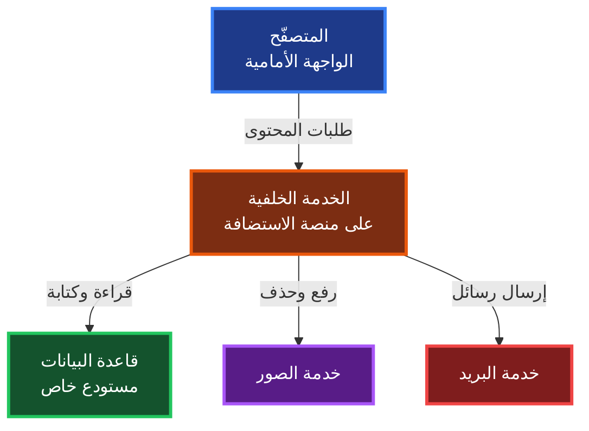

---

2. الطبقات الأربع

الخدمة الخلفية مقسّمة إلى أربع طبقات، كل طبقة لها مسؤولية واحدة فقط:


شرح الطبقات

الموجّه : نقطة الدخول الوحيدة، يستقبل كل الطلبات ويعرف إلى أي معالج يوجّهها.

الطبقات الوسطى : ثلاث طبقات تعمل قبل المعالج:

· المصادقة : تتحقق من هوية صاحب الطلب
· الأخطاء : توحّد شكل كل الأخطاء
· حد الطلبات : تمنع الإغراق

المعالجات : سبع مجموعات، كل مجموعة تتعامل مع نطاق محدد:

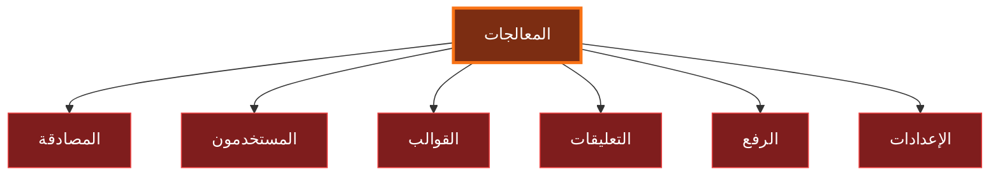

الخدمات : ثلاث خدمات خارجية، كل واحدة تتصل بجهة مستقلة.

النواة : إعدادات وأدوات مشتركة يستخدمها كل شيء.

---

3. رحلة الطلب الواحد

هذه رحلة أي طلب من لحظة ضغط المستخدم حتى وصول الرد:

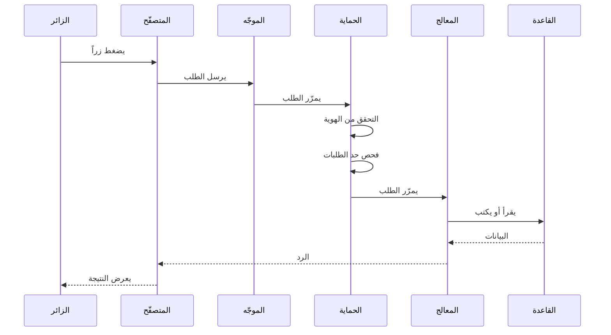

التوقيتات التقريبية لكل خطوة:

الخطوة الزمن التقريبي
الاتصال بالشبكة 20 إلى 80 مللي ثانية
فحص الحماية أقل من 5 مللي ثانية
قراءة من القاعدة 200 إلى 800 مللي ثانية
كتابة في القاعدة 400 إلى 1500 مللي ثانية
الرد الكامل 300 إلى 2000 مللي ثانية

القراءة والكتابة من القاعدة هي الأبطأ لأنهما تمرّان عبر خدمة خارجية.

---

4. قاعدة البيانات

قاعدة البيانات هي مستودع خاص على منصة الاستضافة. داخله مجلدات منظّمة:

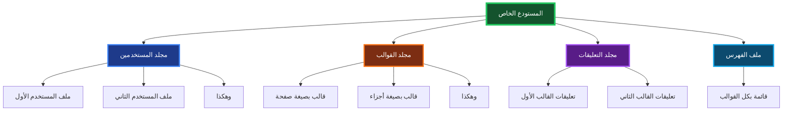

شكل ملف المستخدم

كل ملف مستخدم يحتوي على ثلاثة أقسام:

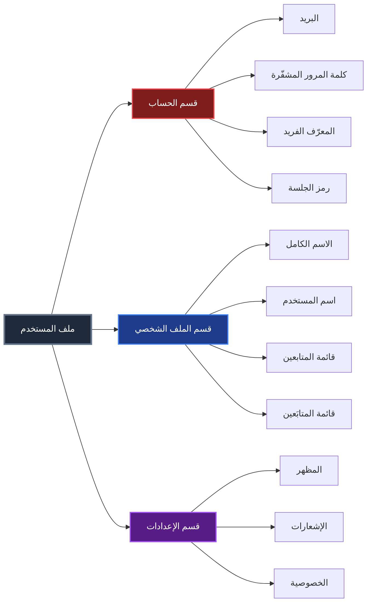

شكل المعرّف الفريد

كل مستخدم يحصل على معرّف من ثلاثة عشر رقماً يبدأ بالرقم سبعة.

· الطول : ثلاثة عشر رقماً بالضبط
· البداية : الرقم سبعة دائماً
· التوليد : عشوائي آمناً
· الاستخدام : داخلي فقط، لا يراه المستخدم
· الغرض : استحالة تخمينه

---

5. رحلة التسجيل والدخول

رحلة التسجيل

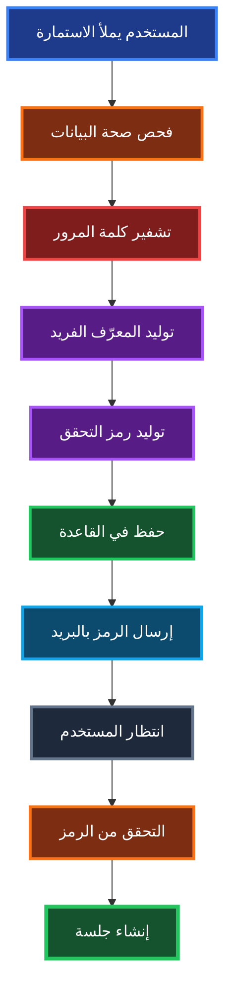

خصائص رمز التحقق:

· الطول : ستة أرقام
· مدة الصلاحية : عشر دقائق
· عدد المحاولات : خمس فقط
· الاستخدام : مرة واحدة فقط

رحلة الدخول


رمز الجلسة

· النوع : رمز موقّع رقمياً
· المدة : ثلاثون يوماً
· التخزين : كعكة محمية + ذاكرة المتصفّح
· ميزة إضافية : رقم إصدار يتغيّر عند تسجيل الخروج من كل الأجهزة

---

6. طبقات الحماية

المشروع يستخدم عشر طبقات حماية متتالية، كل طبقة تصدّ نوعاً من الهجمات:

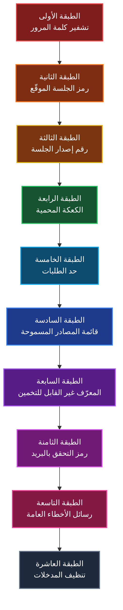

شرح كل طبقة

الطبقة الوظيفة الهدف
الأولى تحويل كلمة المرور إلى رمز غير قابل للعكس حتى لو تسرّبت القاعدة، الكلمات محمية
الثانية توقيع رقمي للمعلومات منع التلاعب ببيانات الجلسة
الثالثة رقم يتغيّر عند الحاجة إبطال كل الأجهزة فوراً
الرابعة كعكة لا يقرأها الجافاسكربت حماية من سرقة الجلسة
الخامسة عدّاد طلبات لكل زائر منع الإغراق والتخريب
السادسة قائمة بعناوين مسموحة منع المواقع الخارجية
السابعة معرّف عشوائي طويل استحالة تخمين بيانات الغير
الثامنة رمز يصل للبريد فقط تأكيد ملكية البريد
التاسعة رسائل غامضة لا تكشف شيئاً عن النظام
العاشرة تنقية النصوص المدخلة منع حقن الأكواد الخبيثة

---

7. متغيّرات البيئة

المشروع يحتاج مجموعة من الإعدادات، تُخزَّن خارج الكود في ملف خاص اسمه .env.

هذا الملف لا يُشارَك أبداً. بدلاً منه، يُشارَك ملف نموذج باسم .env.example يحتوي على أسماء المتغيّرات بدون قيمها الحقيقية.

تصنيف المتغيّرات

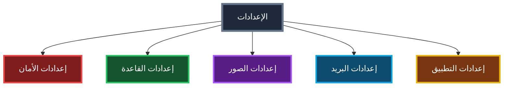

جدول المتغيّرات الكامل

التصنيف اسم المتغيّر القيمة الافتراضية حساس؟
الأمان مفتاح التوقيع يجب تغييره نعم جداً
الأمان بريد المدير فارغ نعم
الأمان المصادر المسموحة فارغ نعم
الأمان حد الطلبات ستون لا
القاعدة اسم المالك فارغ نعم
القاعدة اسم المستودع فارغ نعم
القاعدة الفرع الرئيسي لا
القاعدة رمز الوصول فارغ نعم جداً
القاعدة مسار البيانات مسار المستخدمين لا
الصور مفتاح الخدمة فارغ نعم
الصور رابط الرفع رابط ثابت لا
البريد الخادم خادم البريد لا
البريد المنفذ أربعمائة وخمسة وستون لا
البريد الاتصال الآمن مفعّل لا
البريد البريد المرسل فارغ نعم
البريد كلمة مرور التطبيق فارغة نعم جداً
التطبيق رابط الموقع فارغ لا
التطبيق بيئة التشغيل إنتاج لا
التطبيق مدة الذاكرة المؤقتة ثلاثون دقيقة لا

---

8. الملفات التي لا تُشارَك

قبل مشاركة المشروع مع أي شخص، تأكد من استثناء هذه الملفات والمجلدات:

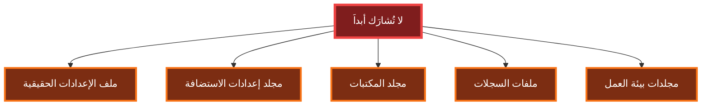

الملفات الآمنة للمشاركة

```mermaid
graph TD
    Yes["آمن للمشاركة"]
    Y1["ملف المكتبات"]
    Y2["ملف الوصف"]
    Y3["ملف الاستضافة"]
    Y4["مجلد الخدمة الخلفية"]
    Y5["مجلد المصدر"]
    Y6["ملفات الصفحات"]
    Y7["ملف الأنماط"]
    Y8["مجلد البرمجة"]
    Y9["ملف التجاهل"]
    Y10["ملف النموذج"]

    Yes --> Y1
    Yes --> Y2
    Yes --> Y3
    Yes --> Y4
    Yes --> Y5
    Yes --> Y6
    Yes --> Y7
    Yes --> Y8
    Yes --> Y9
    Yes --> Y10

    style Yes fill:#14532d,stroke:#22c55e,stroke-width:4px,color:#ffffff
    style Y1 fill:#166534,stroke:#4ade80,stroke-width:2px,color:#ffffff
    style Y2 fill:#166534,stroke:#4ade80,stroke-width:2px,color:#ffffff
    style Y3 fill:#166534,stroke:#4ade80,stroke-width:2px,color:#ffffff
    style Y4 fill:#166534,stroke:#4ade80,stroke-width:2px,color:#ffffff
    style Y5 fill:#166534,stroke:#4ade80,stroke-width:2px,color:#ffffff
    style Y6 fill:#166534,stroke:#4ade80,stroke-width:2px,color:#ffffff
    style Y7 fill:#166534,stroke:#4ade80,stroke-width:2px,color:#ffffff
    style Y8 fill:#166534,stroke:#4ade80,stroke-width:2px,color:#ffffff
    style Y9 fill:#166534,stroke:#4ade80,stroke-width:2px,color:#ffffff
    style Y10 fill:#166534,stroke:#4ade80,stroke-width:2px,color:#ffffff
```

---

9. قائمة المراجعة النهائية

قبل مشاركة المشروع، اتبع هذه القائمة بالترتيب:

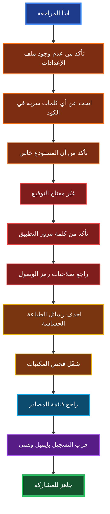

تفاصيل كل خطوة

الخطوة الأولى : تأكد من عدم وجود ملف الإعدادات الحقيقية في المشروع.

الخطوة الثانية : ابحث عن أي كلمات قد تكون سرية: رموز الوصول، كلمات المرور، عناوين البريد.

الخطوة الثالثة : تأكد من أن مستودع البيانات خاص وغير عام.

الخطوة الرابعة : غيّر مفتاح توقيع الجلسة إلى قيمة عشوائية طويلة.

الخطوة الخامسة : تأكد من استخدام كلمة مرور التطبيق وليس كلمة مرور الحساب الأصلية.

الخطوة السادسة : راجع صلاحيات رمز الوصول، يجب أن تكون محدودة بأقل قدر ممكن.

الخطوة السابعة : احذف أي رسائل طباعة تحتوي على معلومات حساسة.

الخطوة الثامنة : شغّل فحص المكتبات للتحقق من عدم وجود ثغرات معروفة.

الخطوة التاسعة : راجع قائمة المصادر المسموحة، واجعلها محدّدة بدقة.

الخطوة العاشرة : جرّب عملية تسجيل كاملة بإيميل وهمي للتأكد من سلامة كل شيء.

---

بيانات إضافية

حالة المشروع

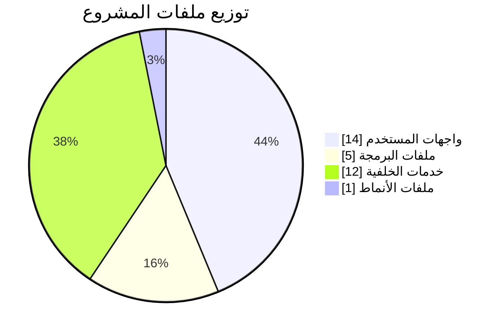

مستويات الخطورة


---

خاتمة

هذا المخطط يعطي صورة كاملة عن بنية المشروع من الداخل.

النقاط الجوهرية التي يجب تذكّرها دائماً:

· ملف الإعدادات الحقيقية لا يُشارَك أبداً
· مستودع البيانات يجب أن يبقى خاصاً
· كل كلمة سر أو مفتاح يُخزَّن في متغيّرات البيئة
· قبل أي مشاركة، اتبع قائمة المراجعة بالترتيب
· عند الشك في أي ملف، اسأل قبل المشاركة
